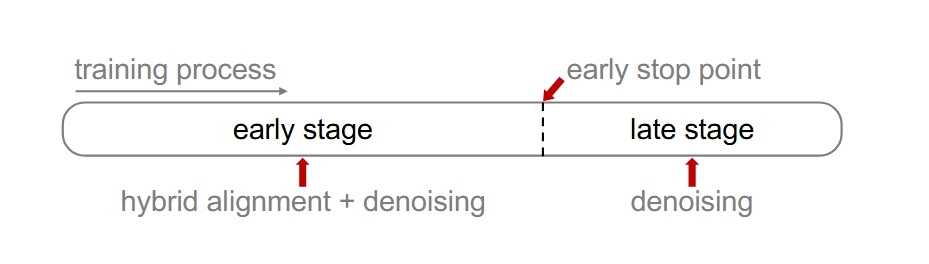

<h1 align="center"> REPA Works Until It Doesn’t: Early-Stopped, Holistic Alignment Supercharges Diffusion Training
</h1>

<div align="center">

[](https://arxiv.org/abs/2505.16792)&nbsp;

Ziqiao Wang $^{1*}$, Wangbo Zhao $^{1*}$, Yuhao Zhou $^{1}$, Zekai Li $^{1}$, Zhiyuan Liang $^{1}$, Mingjia Shi $^{1}$, Xuanlei Zhao $^{1}$,
 Pengfei Zhou $^{1}$, Kaipeng Zhang $^{2\dagger}$, Zhangyang Wang $^{3}$, Kai Wang $^{1\dagger}$, Yang You $^{1}$

$^{1}$ National University of Singapore, $^{2}$ Shanghai AI Laboratory, $^{3}$ University of Texas at Austin

(\*) equal contribution, ($\dagger$) corresponding author. Ziqiao, Wangbo, Zhangyang, and Kai are core contributors.


</div>


### Overview 

Diffusion Transformers (DiTs) deliver state-of-the-art image quality, yet their training remains notoriously slow. A recent remedy---representation alignment (REPA) that matches DiT hidden features to those of a non-generative teacher (e.g., DINO)---dramatically accelerates the early epochs but plateaus or even degrades performance later.   We trace this failure to a capacity mismatch: once the generative student begins modelling the joint data distribution, the teacher's lower-dimensional embeddings and attention patterns become a straitjacket rather than a guide. 

We then introduce HASTE (Holistic Alignment with Stage-wise Termination for Efficient training), a two-phase schedule that keeps the help and drops the hindrance. Phase I applies a holistic alignment loss that simultaneously distills attention maps (relational priors) and feature projections (semantic anchors) from the teacher into mid-level layers of the DiT, yielding rapid convergence. Phase II then performs one-shot termination that deactivates the alignment loss, once a simple trigger such as a fixed iteration is hit, freeing the DiT to focus on denoising and exploit its generative capacity. HASTE speeds up training of diverse DiTs without architecture changes.  

On ImageNet $256{\times}256$, it reaches the vanilla SiT-XL/2 baseline FID in 50 epochs and matches REPA’s best FID in 500 epochs, amounting to a $\boldsymbol{28\times}$ reduction in optimization steps. HASTE also improves text-to-image DiTs on MS-COCO, demonstrating to be a simple yet principled recipe for efficient diffusion training across various tasks.


### Environment Setup
We use the same environment as [REPA](https://github.com/sihyun-yu/REPA).

```bash
conda create -n haste python=3.9 -y
conda activate haste
pip install -r requirements.txt
```

In addition, since our method requires attention maps from [DINOv2](https://github.com/facebookresearch/dinov2), we need to make some minor modifications to the source code. DINOv2 models will be automatically downloaded from `torch.hub`. You can directly replace relevant source documents with ours in [modify_dinov2](./modify_dinov2). Please refer to our [modification guide](modify_dinov2/README.md).
### Dataset

Currently, we support the [ImageNet](https://www.kaggle.com/competitions/imagenet-object-localization-challenge/data) $256\times256$ generation experiment. After downloading the dataset, you can unzip it and conduct data preprocessing following our [preprocessing guide](preprocessing/README.md).

For text-to-image generation experiment on MS-COCO, we mainly follow the preprocessing code in [U-ViT](https://github.com/baofff/U-ViT/tree/main/scripts), and we also provide relevant scripts in /preprocessing.

### Training
#### ImageNet $256\times256$
```bash
accelerate launch train.py \
  --report-to="wandb" \
  --allow-tf32 \
  --mixed-precision="fp16" \
  --seed=0 \
  --path-type="linear" \
  --prediction="v" \
  --weighting="uniform" \
  --model="SiT-XL/2" \
  --enc-type="dinov2-vit-b" \
  --proj-coeff=0.5 \
  --attn-coeff=0.5 \
  --encoder-depth=8 \
  --output-dir="exps" \
  --exp-name="linear-dinov2-b-enc8-es250k" \
  --batch-size 256 \
  --early-stop-point=250000 \
  --data-dir=[YOUR_DATA_PATH]
```

Some options:

- `--model`: `[SiT-B/2, SiT-L/2, SiT-XL/2]` 
- `--enc-type`: `"dinov2-vit-b"` We only support DINOv2-B currently.
- `--proj-coeff`: The weight of feature alignment objective.
- `--attn-coeff`: The weight of attention alignment objective.
- `--encoder-depth`: The alignment depth (starts from 1).
- `--output-dir`: Directory to save checkpoints and logs.
- `--data-dir`: The directory of processed dataset.
- `--early-stop-point`: The iteration when we remove the auxiliary regularizations.

#### MS-COCO

```bash
accelerate launch train_t2i.py \
  --report-to="wandb" \
  --allow-tf32 \
  --mixed-precision="fp16" \
  --seed=0 \
  --path-type="linear" \
  --prediction="v" \
  --weighting="uniform" \
  --enc-type="dinov2-vit-b" \
  --proj-coeff=0.5 \
  --attn-coeff=0.5 \
  --encoder-depth=8 \
  --output-dir="MMDiT" \
  --exp-name="t2i_haste" \
  --data-dir=[YOUR_DATA_PATH] \
  --early-stop-point=150000 \
  --checkpointing-steps=25000 \
  --max-train-steps=150000
```


### Evaluation
Pretrained [checkpoints](https://drive.google.com/drive/folders/1NcPYuxSlMChl2kqxKcj8Hf85rlCM-63J?usp=drive_link) are available.
We mainly follow the generation code in [REPA](https://github.com/sihyun-yu/REPA).
#### ImageNet $256\times256$
50K images will be sampled and the script will generate a .npz file for [ADM evaluation](https://github.com/openai/guided-diffusion/tree/main/evaluations).

```bash
torchrun --nnodes=1 --nproc_per_node=2 --master_port=29500 generate.py \
  --model SiT-XL/2 \
  --ckpt ./2500000.pt \
  --sample-dir=./samples \
  --encoder-depth=8 \
  --num-fid-samples 50000 \
  --path-type=linear \
  --projector-embed-dims=768 \
  --per-proc-batch-size=64 \
  --mode=sde \
  --num-steps=250 \
  --cfg-scale=1.65 \
  --guidance-high=0.72 \
  --guidance-low=0.0
```
You can modify the options of sampler:
- `--mode`: You can choose sde or ode sampler.
- `--num-steps`: The default NFEs is 250.
- `--cfg-scale`: The scale of classifier-free guidance.
- `--encoder-depth`: The alignment depth (starts from 1).
- `--guidance-high` and `--guidance-low`: Arguments for guidance interval.

#### MS-COCO

The script will generate samples according to captions in the validation dataset of MS-COCO.
We use the evaluation script in [U-ViT](https://github.com/baofff/U-ViT/tree/main/scripts) to compute the FID score.

```bash

torchrun --nnodes=1 --nproc_per_node=2 --master_port=29500 generate_t2i.py \
  --ckpt /[YOUR_CKPT_PATH] \
  --sample-dir=/samples \
  --encoder-depth=8 \
  --path-type=linear \
  --projector-embed-dims=768 \
  --per-proc-batch-size=32 \
  --mode=sde \
  --num-steps=250 \
  --cfg-scale=2.25 \
  --guidance-high=1.0 
```

## Citation

If you find our work useful, please consider citing us.
```
@article{wang2025repa,
  title={REPA Works Until It Doesn't: Early-Stopped, Holistic Alignment Supercharges Diffusion Training},
  author={Wang, Ziqiao and Zhao, Wangbo and Zhou, Yuhao and Li, Zekai and Liang, Zhiyuan and Shi, Mingjia and Zhao, Xuanlei and Zhou, Pengfei and Zhang, Kaipeng and Wang, Zhangyang and others},
  journal={arXiv preprint arXiv:2505.16792},
  year={2025}
}
```

## Acknowledgement

The repo is built based on [REPA](https://github.com/sihyun-yu/REPA), [DiT](https://github.com/facebookresearch/DiT), [SiT](https://github.com/willisma/SiT), [edm2](https://github.com/NVlabs/edm2), [DINOv2](https://github.com/facebookresearch/dinov2), and [U-ViT](https://github.com/baofff/U-ViT) repositories.

We sincerely appreciate [Liang Zheng](https://zheng-lab-anu.github.io/) and [Ziheng Qin](https://henryqin1997.github.io/ziheng_qin/) for valuable discussions and feedbacks during this work.  

